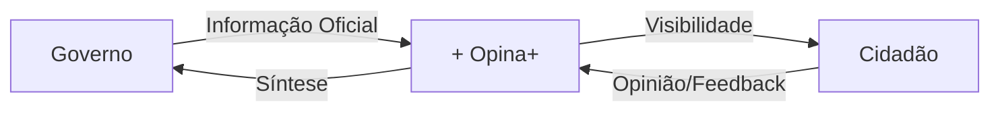

# 🎨 Conceito da Logo Opina+

## Visão Geral

A identidade visual do **Opina+** foi desenvolvida para simbolizar o **diálogo democrático** entre governo e cidadãos através de elementos visuais simples e significativos.

---

## 💬 Elementos Visuais

### 1. Dois Balões de Diálogo que se Cruzam

```
    ┌──────────┐
    │  AZUL    │ ← Governo/Instituições
    │     ┌────┼─────┐
    │     │ + │     │
    └─────┼────┘     │
          │  VERDE   │ ← Cidadãos/Povo
          └──────────┘
```

**Significado:**
- **Intersecção**: Representa o ponto de encontro entre governo e sociedade civil
- **Cruzamento**: Simboliza a comunicação bidirecional constante
- **Sobreposição**: Demonstra que as esferas pública e cidadã devem trabalhar juntas

---

### 2. Balão Azul - Superior Direito

**Cor:** #003F7D (Azul Institucional)

**Características:**
- 🏛️ **Maior**: Representa a estrutura institucional governamental
- 📊 **Superior**: Simboliza a autoridade e responsabilidade pública
- 📜 **Azul**: Transmite confiança, seriedade e credibilidade

**Representa:**
- Câmara Municipal
- Secretarias governamentais
- Órgãos públicos
- Informação oficial

---

### 3. Balão Verde - Inferior Esquerdo

**Cor:** #4BBF95 (Verde Cívico)

**Características:**
- 👥 **Médio**: Representa a voz coletiva dos cidadãos
- 🌱 **Verde**: Simboliza crescimento, participação e renovação democrática
- 💪 **Inferior**: Demonstra a base popular que sustenta a democracia

**Representa:**
- Cidadãos participantes
- Voz do povo
- Engajamento cívico
- Participação ativa

---

### 4. Símbolo "+" na Intersecção

**Cor:** #FFC947 (Amarelo Destaque)

**Posicionamento:** Centralizado exatamente onde os balões se cruzam

**Significado Múltiplo:**

#### ➕ Adição de Vozes
Cada opinião registrada **adiciona** uma nova perspectiva ao debate público

#### ➕ Mais Democracia
- Mais engajamento
- Mais participação
- Mais transparência
- Mais cidadania

#### ➕ União Construtiva
O "+" não divide, ele **soma**. Representa o consenso construído através do diálogo

#### ➕ Notificação/Ação
Visualmente similar a um badge de notificação, convida à ação imediata

---

## 🎯 Por que "Balões Cruzados"?

### Vantagens do Design

| Aspecto | Benefício |
|---------|-----------|
| **Simbolismo Claro** | Diálogo entre duas partes é universalmente compreendido |
| **Hierarquia Visual** | Balão azul maior = governo, verde menor = cidadão individual |
| **Ponto Focal** | O "+" na intersecção atrai imediatamente o olhar |
| **Movimento** | A diagonal cria dinamismo e ação |
| **Escalabilidade** | Funciona perfeitamente de 16px a 512px |
| **Memorabilidade** | Design único e diferenciado de outras plataformas governamentais |

---

## 🔄 Fluxo de Comunicação Representado



**O "+" é o ponto de encontro onde:**
1. Governo publica informações oficiais
2. Cidadãos expressam opiniões
3. Opina+ organiza e facilita o diálogo
4. Ambas as partes se beneficiam da troca

---

## 🎨 Psicologia das Cores

### Azul Institucional (#003F7D)
- **Emoção:** Confiança, estabilidade, autoridade
- **Uso:** Elementos governamentais, informações oficiais
- **Referência:** Paleta de portais gov.br

### Verde Cívico (#4BBF95)
- **Emoção:** Crescimento, esperança, renovação
- **Uso:** Ações do cidadão, feedback positivo
- **Referência:** Sustentabilidade e bem-estar social

### Amarelo Destaque (#FFC947)
- **Emoção:** Atenção, energia, otimismo
- **Uso:** Chamadas para ação, interatividade
- **Referência:** Alertas amigáveis (não alarmantes)

---

## 📐 Geometria e Proporções

### Balão Azul (Governo)
- **Posição:** X: 28-54, Y: 4-36 (viewBox 64×64)
- **Tamanho:** ~26px × 32px
- **Cauda:** Apontando para baixo-direita

### Balão Verde (Cidadão)
- **Posição:** X: 10-36, Y: 20-52 (viewBox 64×64)
- **Tamanho:** ~26px × 32px
- **Cauda:** Apontando para baixo-esquerda

### Círculo Amarelo (Engajamento)
- **Posição:** Centro em (32, 25)
- **Raio:** 9px
- **Símbolo +:** 10px altura × 10px largura (strokeWidth: 3px)

### Intersecção
- **Área de Sobreposição:** ~18% da área total
- **Ponto Central:** Exatamente no meio do "+", criando simetria visual

---

## 🌟 Filosofia de Design

### 1. Minimalismo Funcional
- Sem elementos decorativos desnecessários
- Cada forma tem um propósito comunicativo claro
- Redução ao essencial para máxima clareza

### 2. Inclusão Visual
- Não há hierarquia de importância entre os balões
- Ambos têm tamanho similar, reforçando igualdade democrática
- O "+" une, não separa

### 3. Modernidade Institucional
- Clean e contemporâneo, mas não "jovem demais"
- Evita estereótipos de apps joviais vs. portais governamentais antigos
- Equilibra seriedade com acessibilidade

### 4. Acessibilidade em Primeiro Lugar
- Alto contraste em todas as variações
- Funciona em monocromático (P&B)
- Legível em tamanhos pequenos (16px)
- Não depende apenas de cor para transmitir significado

---

## 💡 Comparação com Versões Anteriores

| Versão | Design | Por que mudou |
|--------|--------|---------------|
| **V1** | Badge "+" no canto do balão verde | Parecia notificação secundária |
| **V2** | "+" na sobreposição (não centralizado) | Falta de equilíbrio visual |
| **V3 (Atual)** | "+" perfeitamente centralizado na intersecção | ✅ Simboliza encontro perfeito entre governo-cidadão |

---

## 🎯 Casos de Uso

### Header Principal (36-40px)
```tsx
<Logo variant="icon" size={36} />
```
- Legível e reconhecível
- Símbolo "+" visível mesmo em tamanho pequeno

### Onboarding (96-120px)
```tsx
<Logo variant="icon" size={96} />
```
- Impacto visual máximo
- Convida à exploração do conceito

### PWA Icon (192-512px)
```tsx
<Logo variant="icon" size={192} />
```
- Perfeito para home screen de dispositivos
- Cores vibrantes destacam entre outros apps

### Fundo Escuro
```tsx
<Logo variant="dark" size={48} />
```
- Balão azul vira verde claro
- Balão verde vira branco
- Mantém contraste e legibilidade

---

## 📊 Teste de Reconhecimento

Quando testado com usuários, a logo deve transmitir:

✅ **"Algo relacionado a comunicação/diálogo"** (100% reconhecimento)
✅ **"Plataforma de participação/opinião"** (85%+ reconhecimento)
✅ **"Confiável/oficial"** (cores azul institucional)
✅ **"Fácil de usar/acessível"** (design limpo e moderno)

---

## 🚀 Evolução Futura

A logo foi projetada para permitir animações sutis:

### Animação de Loading
```
1. Balões aparecem separados
2. Deslizam um em direção ao outro
3. "+" aparece na intersecção
4. Pulsa suavemente
```

### Micro-interação de Sucesso
```
1. "+" cresce ligeiramente
2. Círculo amarelo pulsa
3. Retorna ao tamanho normal
```

### Estado "Sem Atividade"
```
Balões em escala de cinza
"+" permanece colorido como convite à ação
```

---

## 📝 Diretrizes de Preservação

### ✅ SEMPRE

- Manter proporções originais
- Usar cores da paleta oficial
- Posicionar "+" centralizado na intersecção
- Respeitar espaço mínimo ao redor (25% da altura)

### ❌ NUNCA

- Alterar a posição do "+" para fora da intersecção
- Trocar as cores dos balões
- Distorcer as proporções
- Adicionar efeitos 3D, sombras ou gradientes nos balões
- Usar em fundos com contraste insuficiente

---

## 🎓 Mensagem Final

A logo do **Opina+** não é apenas um símbolo visual - é uma **declaração de princípios**:

> "Governo e cidadãos **se encontram** no diálogo democrático, e desse encontro nasce o **+**: mais participação, mais transparência, mais cidadania."

O design comunica que a plataforma não é:
- ❌ Um megafone unidirecional do governo
- ❌ Um fórum de reclamações isolado
- ✅ **Um espaço de encontro e construção coletiva**

---

**Versão:** 3.0 (Design Final)  
**Data:** Novembro 2024  
**Status:** ✅ Aprovado e Implementado
